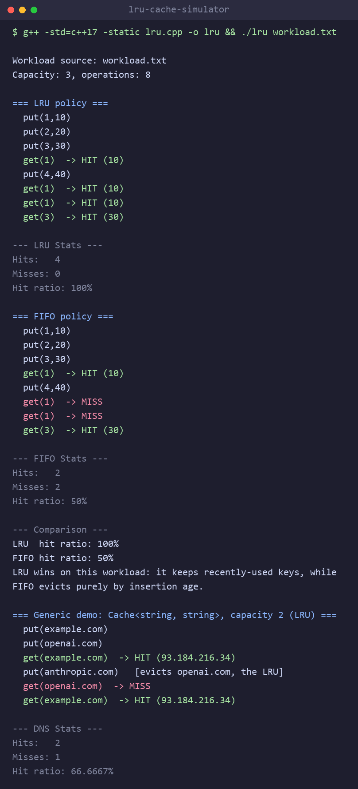

# Cache Simulator — LRU vs FIFO (C++)

A small CPU-cache simulator with **O(1)** `get` and `put`, supporting two
eviction policies — **LRU (Least Recently Used)** and **FIFO (First In, First
Out)** — so you can run the same workload through both and compare hit ratios.
It is a **generic** `Cache<K, V>` (works with any key/value types), tracks hits,
misses, and the final hit ratio, and can be driven from a workload file.

The LRU design is the same as the classic LeetCode problem
[#146 "LRU Cache"](https://leetcode.com/problems/lru-cache/).

## The idea

A cache holds a limited number of items. When it is full and a new item
arrives, we must evict one. **LRU evicts the item that was used least recently.**

To make both operations O(1), two data structures work together:

- **Doubly linked list** — holds keys in usage order.
  Front = most recently used (MRU), back = least recently used (LRU).
  Using a key moves its node to the front; eviction removes the node at the back.
- **Hash map** (`unordered_map<K, Node*>`) — maps each key to its node in the
  list, so any node is found in O(1) without walking the list.

Together: the hash map gives O(1) **lookup**, the linked list gives O(1)
**reordering and eviction**. Neither alone can do both.

Two dummy **sentinel** nodes (`head`, `tail`) bracket the list so insertion and
removal never need special cases for an empty list or the first/last node.

## LRU vs FIFO

Both policies share the exact same structure and evict the node just before
`tail`. The **only** difference is what happens when a key is *used*:

- **LRU** — a `get` (or a `put` on an existing key) moves that node to the
  front, so order reflects *recency of use*. The victim is the least recently
  used key.
- **FIFO** — using a key does **nothing** to the order, so order reflects
  *insertion time*. The victim is the oldest inserted key, even if it was just
  read.

In code that difference is a single guarded branch:

```cpp
if (policy == Policy::LRU) { remove(node); addToFront(node); }
```

FIFO ties LRU on a no-reuse scan and is cheaper (never reorders), but on
workloads with reused "hot" keys, LRU keeps them and FIFO keeps evicting them —
which is why LRU is the usual default. The demo below shows LRU at 100% vs
FIFO at 50% on the same sequence.

## Generic over key/value types

The cache is a template, `Cache<K, V>`, so the same code works for
`Cache<int, int>` or `Cache<string, string>` (e.g. a DNS cache) — the compiler
stamps out a concrete class per instantiation, at zero runtime cost.

Because `V` can be any type, `get` can't signal "not found" with a sentinel like
`-1`. Instead it returns **`std::optional<V>`** — the value on a hit, `nullopt`
on a miss:

```cpp
optional<int> v = cache.get(1);
if (v.has_value()) use(*v);   // hit
else                miss();   // nullopt
```

Requirements on the types: `K` must be hashable (it is an `unordered_map` key),
and both `K` and `V` must be default-constructible (the sentinels store `K()`,
`V()`).

## Operations

| Method              | What it does                                                          |
|---------------------|----------------------------------------------------------------------|
| `Cache<K,V>(cap, policy, name)` | Construct a cache with `Policy::LRU` or `Policy::FIFO`.   |
| `put(key, value)`   | Insert/update a key. If full, evict the victim first.                |
| `get(key)`          | Return `optional<V>`: the value (a **hit**) or `nullopt` (a **miss**). |
| `hitRatio()`        | Hits / total accesses, as a fraction.                                |
| `printStats()`      | Print hit count, miss count, and hit ratio.                          |

Under LRU, every `get`/`put` on an existing key marks it most-recently-used.

## Build & run

Dynamic linking is broken on my machine, so build statically:

```bash
g++ -std=c++17 -static lru.cpp -o lru
./lru                # runs the built-in demo workload
./lru workload.txt   # runs your own workload from a file
```

## Workload files

Instead of the built-in demo, you can drive the simulator from a text file and
compare LRU vs FIFO on your own access trace. Format (one directive per line):

| Line          | Meaning                                        |
|---------------|------------------------------------------------|
| `cap N`       | Set the cache capacity to `N`.                 |
| `put KEY VAL` | Insert or update `KEY` with value `VAL`.       |
| `get KEY`     | Look up `KEY` (counts as a hit or a miss).     |
| `# ...`       | Comment — ignored. Blank lines ignored too.    |

The workload is parsed into a list of operations once, then replayed through
both an LRU and a FIFO cache so the comparison is apples-to-apples. See
[`workload.txt`](workload.txt) for an example:

```
cap 3
put 1 10
put 2 20
put 3 30
get 1
put 4 40
get 1
get 1
get 3
```

## Sample output

Running `./lru workload.txt` (key 1 is "hot" — read repeatedly) through both
policies:



```
Workload source: workload.txt
Capacity: 3, operations: 8

=== LRU policy ===   -> Hits: 4  Misses: 0  Hit ratio: 100%
=== FIFO policy ===  -> Hits: 2  Misses: 2  Hit ratio: 50%

=== Generic demo: Cache<string, string>, capacity 2 (LRU) ===
  get(example.com) -> HIT, get(openai.com) -> MISS (evicted)  -> Hit ratio: 66.7%
```

Why LRU and FIFO diverge: after `put 1,2,3` the order is `[3,2,1]`, so key 1 is
oldest. The `get(1)` moves key 1 to the front **under LRU only**. So `put(4,40)`
evicts key 2 under LRU (keeping the hot key 1) but evicts key 1 under FIFO
(oldest) — after which the repeated `get(1)` calls hit under LRU and miss under
FIFO. A read changes eviction order under LRU; under FIFO it never does.

The generic demo at the bottom runs the identical class as `Cache<string,
string>` (a mini DNS cache) to show it is not int-only.

## Complexity

| Operation | Time | Space |
|-----------|------|-------|
| `get`     | O(1) | —     |
| `put`     | O(1) | —     |
| Overall   | —    | O(capacity) |

## Memory

Every `new` has a matching `delete`: evicted nodes are freed in `put`, and the
destructor `~Cache()` frees all survivors (including sentinels) at shutdown,
so nothing leaks.
